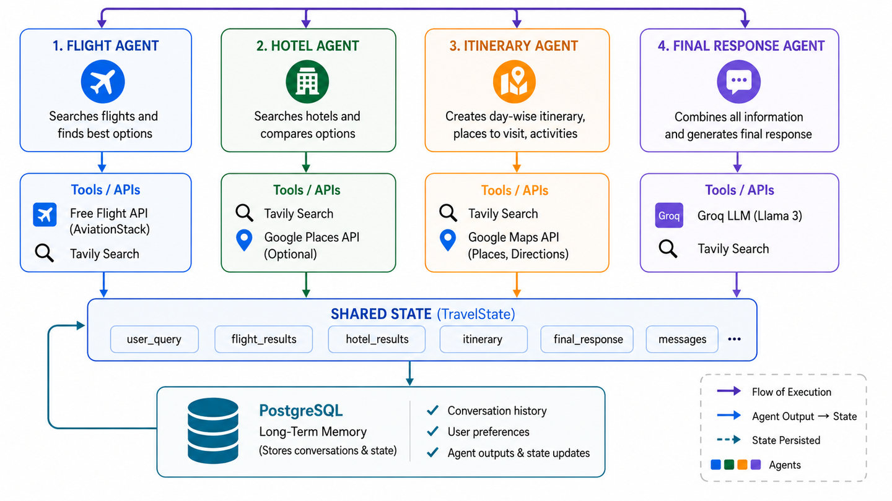

# Original roadmap

The diagram this project was built from — a 4-agent LangGraph pipeline with a
shared `TravelState` and long-term memory in PostgreSQL.

> This is a Multi Agents travel planner that turns a natural-language trip
> request into a practical travel plan with flight suggestions, hotel ideas,
> and a day-by-day itinerary. The project uses a multi-agent workflow built
> with LangGraph, combining a flight-search agent, a hotel-research agent, an
> itinerary-planning agent, and a final response agent, all coordinated
> through a LangGraph workflow.

## What's implemented vs. deferred

| Diagram | This codebase |
|---|---|
| LangGraph, 4 agents + shared state | ✅ [app/agent/graph.py](../app/agent/graph.py), [state.py](../app/agent/state.py) — plus a `resolve_destination` coordinator step the diagram doesn't show, for when the traveller leaves the destination open |
| Groq LLM (Llama 3) | 🔄 built for Groq first, then switched to **OpenAI** (`gpt-4o-mini` by default — must support JSON mode) at the user's request — see [app/agent/llm.py](../app/agent/llm.py) |
| AviationStack, Google Places/Maps, Tavily Search | 🔄 real fetch clients for AviationStack and Tavily exist and are tested against the live APIs ([app/providers/aviationstack.py](../app/providers/aviationstack.py), [tavily.py](../app/providers/tavily.py)) — **not wired into `TravelProvider`**. The running pipeline still uses one deterministic mock provider ([app/providers/mock.py](../app/providers/mock.py)) for zero-key operation; wiring a fetch client in as a `live` source is the next step. No Google Places/Maps client exists yet. |
| PostgreSQL long-term memory | ✅ `SqlTripStore` ([app/store.py](../app/store.py)) behind the same `TripStore` Protocol as the in-memory default; `docker-compose.yml` runs Postgres 16. Stores each trip as one JSON row rather than a normalized schema — there's nothing to migrate when `PlannedTrip`'s shape changes. |
| (not in the diagram) Frontend | ✅ Added after the fact, at the user's request — plain HTML/CSS/JS, dark theme, single free-text prompt box (`app/agent/prompt_parser.py` turns the sentence into a `TripRequest`). See [README.md](../README.md#frontend). |
| (not in the diagram) MCP client | 🔄 [app/providers/tavily_mcp.py](../app/providers/tavily_mcp.py) — a second, alternate way to reach Tavily search results, this time over MCP (`https://mcp.tavily.com/mcp/`, streamable HTTP) instead of Tavily's REST API. Verified against the live server; normalizes through the same `tavily.normalize_search` since the tool's JSON matches the REST shape. Same status as the other fetch clients: built and tested, **not wired into `TravelProvider`**. See [README.md](../README.md#mcp-client). |
| (not in the diagram) MCP server | 🔄 [app/mcp_server/aviationstack.py](../app/mcp_server/aviationstack.py) — the other direction: our own MCP server (official `mcp` SDK's `MCPServer`), exposing `search_flights` over AviationStack's `fetch_flights`/`normalize_flights`. Runnable over stdio or streamable HTTP. Same status as the fetch clients: built and tested, **not wired into `TravelProvider`**. See [README.md](../README.md#mcp-server-our-own-wrapping-aviationstack). |

The diagram's per-agent "Tools/APIs" boxes don't specify whether flight/hotel/
itinerary search itself is LLM-driven tool-calling or deterministic retrieval
with the LLM reasoning over the results. This codebase takes the latter,
simpler path — each node calls its provider function directly, then asks the
LLM to pick/plan over what came back — documented in
[README.md](../README.md#architecture).
